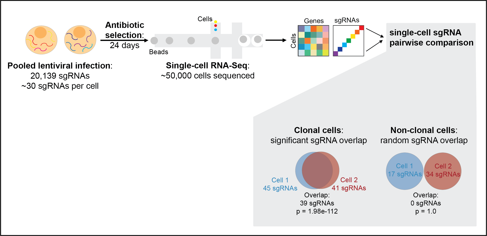

# Computational identification of clonal cells in single-cell CRISPR screens

## Overview
#### This repository described the scripts for identifying clones in single-cell CRISPR screens with multiplexed sgRNA barcodes. 

## Requirement
* python (3.6 +)
* Numpy (1.16 +)
* Pandas (0.25 +)
* Scipy (1.1 +)
* Matplotlib (3.3 +)

## Original Fastq Files
GEO accession: GSE185995

## Contributors 
* First Author: Yihan Wang `Yihan.Wang@UTSouthwestern.edu`
* Corresponding Author: Gary Hon `Gary.Hon@UTSouthwestern.edu`
